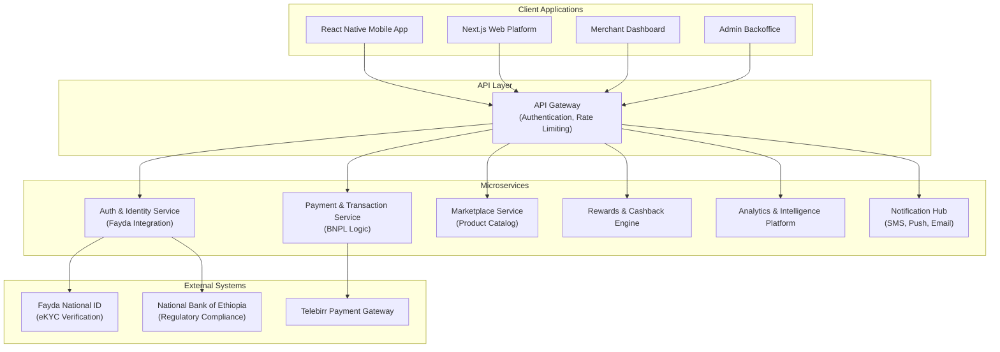

# Meqenet.et - Ethiopia's Leading BNPL Financial Super-App


[](https://github.com/meqenet/meqenet/actions)
[](https://github.com/meqenet/meqenet/actions)
[](LICENSE)

## 🇪🇹 Overview

Meqenet.et is Ethiopia's first comprehensive financial super-app, combining enterprise-grade Buy
Now, Pay Later (BNPL) services with a complete shopping ecosystem, cashback rewards, and financial
wellness tools. Built specifically for the Ethiopian market with **Fayda National ID integration**
and full **Amharic language support**.

### 🎯 Key Features

- **Flexible Payment Options**: Interest-free short-term and competitive financing plans
- **Pay in 4**: Four interest-free installments over 6 weeks
- **Pay in 30**: Full payment deferred for 30 days with buyer protection
- **Competitive Financing**: 3-24 month plans with transparent rates (7.99%-29.99% APR)
- **Cashback Ecosystem**: Up to 10% cashback at partner merchants
- **Ethiopian Integration**: Exclusive Fayda National ID verification and Telebirr payments
- **Marketplace**: Comprehensive e-commerce platform with verified merchants
- **Financial Wellness**: Budgeting tools, savings goals, and financial education

## 🏗️ Architecture

Meqenet.et is built on a **Microservice Architecture** for the backend with **Feature-Sliced
Architecture (FSA)** for codebase organization, ensuring scalability, security, and maintainability.

### Core Architectural Principles

- **Zero Trust Security Model**: No implicit trust between components
- **Microservice Governance**: Single responsibility, bounded contexts, explicit APIs
- **Polyglot Persistence**: Each service owns its database
- **Independent Deployability**: Services can be deployed independently
- **Resilience & Fault Isolation**: Designed for failure with circuit breakers and retries

### System Components



## 🛠️ Technology Stack

### Backend ("Paved Road" Stack)

- **Language**: TypeScript with Node.js (LTS)
- **Framework**: NestJS
- **Database**: PostgreSQL with Prisma ORM
- **Cache**: Redis (AWS ElastiCache)
- **Message Queue**: AWS SNS/SQS
- **API Communication**: gRPC (internal), REST + OpenAPI 3.0 (external)

### Frontend

- **Mobile**: React Native with TypeScript
- **Web**: Next.js with TypeScript and Tailwind CSS
- **State Management**: Zustand/Redux Toolkit
- **Architecture**: Feature-Sliced Architecture (FSA)

### Infrastructure & DevOps

- **Cloud Provider**: Amazon Web Services (AWS)
- **Containerization**: Docker
- **Orchestration**: Amazon ECS/EKS
- **Infrastructure as Code**: Terraform
- **CI/CD**: GitHub Actions
- **Monitoring**: Prometheus, Grafana, OpenTelemetry
- **Secrets Management**: AWS Secrets Manager

## 🚀 Quick Start

### Prerequisites

- Node.js 18+ (LTS)
- Docker and Docker Compose
- AWS CLI configured
- Git

### Development Setup

1. **Clone the repository**

   ```bash
   git clone https://github.com/meqenet/meqenet.git
   cd meqenet
   ```

2. **Install dependencies**

   ```bash
   # Backend dependencies
   pnpm install

   # Frontend dependencies
   cd frontend && pnpm install
   cd ../mobile && pnpm install
   ```

3. **Environment Configuration**

   ```bash
   cp .env.example .env.local
   # Configure your environment variables
   ```

4. **Start development services**

   ```bash
   # Start local development stack
   docker-compose up -d

   # Run database migrations
   pnpm run db:migrate

   # Start development servers
   pnpm run dev
   ```

### Project Structure

```
meqenet/
├── docs/                          # Comprehensive project documentation
│   ├── Stage 1 - Foundation/      # Architecture, security, governance
│   ├── Stage 2 - Development/     # Development guidelines, testing
│   └── Stage 3 - Deployment/      # Infrastructure, monitoring
├── backend/                       # Microservices monorepo
│   ├── services/                  # Individual microservices
│   │   ├── auth-service/          # Authentication & identity
│   │   ├── payment-service/       # BNPL & payments
│   │   ├── marketplace-service/   # Product catalog & merchants
│   │   └── rewards-service/       # Cashback & loyalty
│   ├── shared/                    # Shared libraries & utilities
│   └── infrastructure/            # Terraform configurations
├── frontend/                      # Next.js web applications
│   ├── consumer-app/              # Main consumer web app
│   ├── merchant-portal/           # Merchant dashboard
│   └── admin-portal/              # Administrative interface
├── mobile/                        # React Native mobile app
├── tasks/                         # Project management & progress tracking
└── .github/                       # GitHub workflows & templates
```

## 🔒 Security Framework

Meqenet.et implements a **Zero Trust Security Model** with comprehensive protections:

### Core Security Features

- **Ethiopian Fayda National ID Integration**: Exclusive identity verification method
- **Mutual TLS (mTLS)**: Mandatory for all internal service communication
- **Data Encryption**: AES-256-GCM at rest, TLS 1.3 in transit
- **Multi-Factor Authentication**: SMS, email, biometric verification
- **Real-time Fraud Detection**: AI-powered transaction monitoring
- **NBE Compliance**: Full regulatory compliance framework

### Security Zones

- **High-Security Zone**: Auth, Payments, KYC, Credit services
- **Medium-Security Zone**: Merchant, Marketplace, Rewards services
- **Controlled-Security Zone**: Analytics, Notifications, Search services

## 📋 Development Guidelines

### Code Quality Standards

- **Linting**: ESLint with strict security rules
- **Formatting**: Prettier with consistent standards
- **Type Safety**: TypeScript strict mode enabled
- **Testing**: Unit, integration, and E2E tests required
- **Security**: SAST/DAST scanning in CI/CD pipeline

### Architecture Compliance

- **Feature-Sliced Architecture**: Mandatory for all frontend/backend code
- **Microservice Principles**: Single responsibility, bounded contexts
- **API Design**: OpenAPI 3.0 spec-first development
- **Database Per Service**: No shared databases between services

### Git Workflow

- **Branch Protection**: Required PR reviews and passing checks
- **Commit Standards**: Conventional commits with clear messages
- **Security Hooks**: Pre-commit linting and vulnerability scanning
- **Documentation**: Living docs with Mermaid.js diagrams

## 🌍 Ethiopian Localization

- **Language Support**: Full Amharic and English localization
- **Calendar Integration**: Ethiopian calendar for dates and holidays
- **Cultural Adaptation**: Ethiopian model photography and local scenarios
- **Payment Integration**: Telebirr, HelloCash, CBE Birr, M-Pesa support
- **Regulatory Compliance**: NBE directives and Ethiopian data protection laws

## 🤝 Contributing

Please read our [Contributing Guidelines](CONTRIBUTING.md) and [Code of Conduct](CODE_OF_CONDUCT.md)
before submitting contributions.

### Development Process

1. Create feature branch from `develop`
2. Follow Feature-Sliced Architecture patterns
3. Write comprehensive tests
4. Ensure security compliance
5. Submit pull request with detailed description

## 📊 Project Management

Track development progress using our comprehensive task management system:

- **Task Tracking**: See [tasks/tasks.yaml](tasks/tasks.yaml)
- **Progress Updates**: Use [tasks/update_progress.py](tasks/update_progress.py)
- **Development Stages**: 12 stages from Foundation to Continuous Improvement

## 📖 Documentation

Comprehensive documentation is available in the `docs/` directory:

- **[Architecture Governance](docs/Stage%201%20-%20Foundation/01-Architecture_Governance.md)**:
  System design principles
- **[Security Framework](docs/Stage%201%20-%20Foundation/07-Security.md)**: Zero Trust security
  model
- **[Technology Stack](docs/Stage%201%20-%20Foundation/09-Tech_Stack.md)**: "Paved Road" technology
  choices
- **[API Governance](docs/Stage%201%20-%20Foundation/02-API_Specification_and_Governance.md)**: API
  design standards
- **[Product Requirements](docs/Stage%201%20-%20Foundation/04-PRD.md)**: Complete product
  specification

## 🚀 Deployment

### Environments

- **Development**: Local development with Docker Compose
- **Staging**: AWS ECS with full production simulation
- **Production**: AWS EKS with multi-AZ deployment

### Infrastructure

- **Infrastructure as Code**: Terraform for all AWS resources
- **Container Security**: Vulnerability scanning and hardened images
- **Monitoring**: Comprehensive observability with Prometheus/Grafana
- **Backup Strategy**: Automated backups with point-in-time recovery

## 📄 License

This project is proprietary software owned by Meqenet.et. See [LICENSE](LICENSE) for details.

## 🆘 Support

- **Technical Issues**: Create an issue using our templates
- **Security Concerns**: Email security@meqenet.et
- **General Questions**: Contact team@meqenet.et

---

**Built with ❤️ for Ethiopia's Financial Future**

_Meqenet.et - Empowering Ethiopian consumers and merchants through innovative financial technology_
