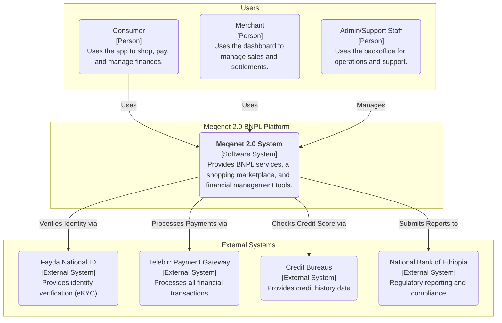

# 22. Architecture Governance & Living Diagrams

## 1. Overview

This document establishes the governance framework for all architectural diagrams within the Meqenet
2.0 ecosystem. The primary goal is to ensure that our architectural representations are accurate,
up-to-date, and treated as living documentation ("docs-as-code"). All diagrams are
version-controlled in Git alongside the source code they represent.

This approach replaces static, difficult-to-maintain diagrams (e.g., images, Visio files, ASCII art)
with a standardized, code-based methodology.

## 2. Official Standard: Mermaid.js

**Mermaid.js is the single, mandatory standard for all new architectural diagrams.**

- **Why Mermaid?**:
  - **Version Controllable**: Plain text definitions can be managed in Git, allowing for history,
    diffing, and pull requests.
  - **Integrated**: Renders directly in Markdown, keeping diagrams and explanatory text
    synchronized.
  - **Accessible**: Text-based format is more accessible and easier to edit than binary formats.
  - **Standardized**: Provides a consistent set of diagram types (C4, ERD, Sequence, etc.) for use
    across all teams.

## 3. Diagram Management and Review Process

1.  **Creation & Location**:
    - **High-Level Diagrams**: Key, system-wide diagrams like the System Context diagram below
      reside in this document as the canonical source.
    - **Feature-Specific Diagrams**: Diagrams relevant to a specific feature, component, or service
      (e.g., a sequence diagram for the checkout flow) should be embedded directly within the
      relevant Markdown document in the `docs` directory.
2.  **Review**: All new or modified diagrams must be submitted as part of a pull request and are
    subject to the same review process as source code. Reviewers must validate the diagram for
    accuracy, clarity, and adherence to the defined style.
3.  **Updates**: Diagrams are not "fire-and-forget." They must be updated as part of any change that
    alters the architecture they describe. Stale diagrams must be either updated or removed.

## 4. Microservice Governance Principles

To ensure our microservice architecture remains scalable, resilient, and agile, all services must
adhere to the following core governance principles:

- **Single Responsibility Principle (SRP)**: Each microservice must be responsible for a single,
  well-defined business capability (e.g., User Authentication, Payment Processing). This limits the
  scope of each service, making it easier to develop, test, and maintain.
- **Bounded Context**: Services must be designed around a specific business domain or "bounded
  context." The language used within the service (code, data models) should be specific to that
  domain, avoiding ambiguity and overlap with other services.
- **Explicit APIs (API as the Contract)**: Services must not communicate through shared databases or
  by accessing each other's internal logic. All communication must occur through well-defined,
  versioned APIs (e.g., REST, gRPC). The API is the formal contract between services.
- **Decentralized Data Management**: Each microservice is responsible for its own data and owns its
  own database. This "polyglot persistence" approach allows each service to choose the database
  technology best suited to its needs (e.g., SQL for transactions, NoSQL for product catalogs),
  preventing large, monolithic databases that create bottlenecks.
- **Independent Deployability**: Each microservice must be independently deployable. A change to one
  service should not require other services to be rebuilt or redeployed. This is critical for
  achieving development agility and rapid, low-risk releases.
- **Resilience and Fault Isolation**: Services must be designed for failure. They should handle the
  failure of their dependencies (other services, databases) gracefully without cascading failures
  across the system. Techniques like circuit breakers, retries, and timeouts are mandatory.

## 5. Master System Context Diagram (C4 Model - Level 1)

This diagram represents the highest level of abstraction for the Meqenet system, illustrating how it
interacts with its users and external systems. It serves as the primary entry point for
understanding the system's scope.

## 6. Other Key Diagram Types

While the C4 model is preferred for static structure, teams are encouraged to use other Mermaid
diagram types as needed:

- **Sequence Diagrams**: For modeling interactions and API call flows.
- **Entity Relationship Diagrams (ERDs)**: For database schema design, to be embedded in
  `07. Database.md`.
- **Flowcharts**: For business logic and user flows.
- **Gantt Charts**: For project planning in documents like `11. Development_Plan.md`.
