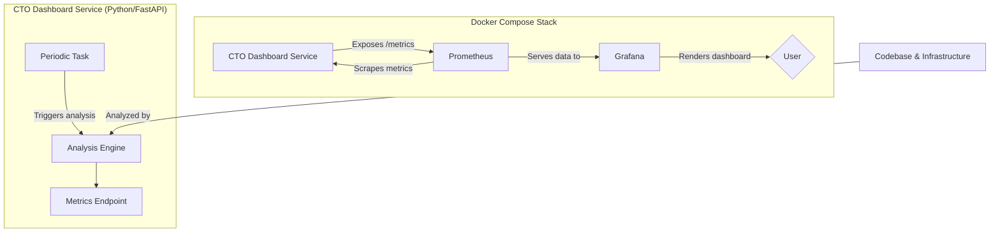

# Enterprise Technology Intelligence Platform v3.0

This directory contains the **Enterprise Technology Intelligence Platform** - a sophisticated,
AI-powered technology governance system designed specifically for the Meqenet FinTech platform
operating in Ethiopia. This platform provides comprehensive technology risk assessment, predictive
analytics, and strategic insights for technology leadership.

**Version 3.0 now includes a full-featured, real-time monitoring stack with Prometheus and
Grafana.**

## 🚀 Platform Overview

The Enterprise Technology Intelligence Platform represents a quantum leap from basic technical
monitoring to a comprehensive, data-driven technology governance system. It combines traditional
software quality metrics with advanced AI analytics, real-time monitoring, and Ethiopian
FinTech-specific compliance tracking.

### Key Capabilities

- **📊 Continuous Monitoring Stack**: Real-time visualization of all technology health metrics via a
  pre-built Grafana dashboard.
- **🤖 AI-Powered Predictive Analytics**: Machine learning models for incident prediction and
  performance forecasting.
- **🌍 Ethiopian FinTech Integration**: Specialized monitoring for NBE API, Fayda ID services, and
  EthSwitch.
- **📡 Real-Time Metrics Service**: The dashboard now runs as a long-running service exposing a
  `/metrics` endpoint for Prometheus.
- **🏗️ Architecture Compliance**: Feature-Sliced Architecture validation and microservice health
  analysis.
- **📈 Executive Intelligence**: C-level dashboards with actionable strategic recommendations.

## 🏛️ Architecture

### v3.0 - Continuous Monitoring Architecture

The platform has evolved from a one-off script into a continuously running service, feeding data
into a powerful monitoring and visualization stack.



### Modular Intelligence System

```
Enterprise Technology Intelligence Platform/
├── modules/
│   ├── __init__.py           # Module exports and version info
│   ├── intelligence.py       # AI-powered predictive analytics engine
│   ├── monitoring.py         # Real-time system and service monitoring
│   ├── compliance.py         # Ethiopian FinTech regulatory compliance
│   └── ...                   # Other intelligence modules
├── monitoring/
│   ├── docker-compose.yml    # Main Docker Compose for the monitoring stack
│   ├── prometheus/
│   │   └── prometheus.yml    # Prometheus configuration
│   └── grafana/
│       ├── provisioning/     # Grafana auto-provisioning
│       └── dashboards/       # Pre-built dashboard JSON
├── cto_config.ini            # Enterprise configuration
├── cto_dashboard_enterprise.py  # Main FastAPI service
├── Dockerfile                # Dockerfile for the service
├── requirements.txt          # Python dependencies
└── test_enterprise_platform.py # Comprehensive test suite
```

## 🔧 Continuous Monitoring Setup

This is the recommended way to run the platform for real-time insights.

### Prerequisites

- **Docker** and **Docker Compose**
- **Python 3.9+** (for the service)
- **Git** (for repository analysis)

### 1. Launch the Monitoring Stack

From the project root directory (`Meqenet/`), run the following command:

```bash
docker-compose -f governance/CTO/monitoring/docker-compose.yml up --build
```

This command will:

1.  Build the `cto-dashboard-service` Docker image.
2.  Start the CTO Dashboard service, Prometheus, and Grafana containers.
3.  Automatically provision Grafana with the Prometheus data source and the CTO dashboard.

### 2. Access the Dashboards

- **Grafana Dashboard**: [http://localhost:3000](http://localhost:3000)
  - **Login**: `admin` / `admin`
  - The "CTO Enterprise Technology Intelligence Dashboard" will be set as the default homepage.

- **Prometheus UI**: [http://localhost:9090](http://localhost:9090)
  - You can use this to explore the raw metrics (e.g., query `cto_risk_overall_score`).

The CTO Dashboard service will automatically run its analysis every **30 minutes** and update the
metrics, which will then be reflected in your Grafana dashboard.

## ⚙️ Manual Script Execution (for Debugging)

If you need to run a one-off analysis for debugging purposes, you can still execute the script
directly.

### 1. Install Dependencies

```bash
# Navigate to CTO governance directory
cd governance/CTO

# Install enterprise dependencies
pip install -r requirements.txt
```

### 2. Run the Script

```bash
# Run the script directly
python cto_dashboard_enterprise.py
```

**Note:** This will start the web service on `http://localhost:8008` but will not launch the full
Prometheus/Grafana stack. It is primarily for testing the analysis logic.

---

## The rest of this README details the specific features, configuration, and advanced analytics capabilities of the platform.

## 📊 Enterprise Features

### Technology Risk Assessment

The platform provides comprehensive risk scoring across five dimensions:

| Risk Dimension           | Weight | Description                                              |
| ------------------------ | ------ | -------------------------------------------------------- |
| **Security Risk**        | 25%    | Vulnerability analysis, secret detection, NBE compliance |
| **Performance Risk**     | 20%    | Response times, error rates, resource utilization        |
| **Maintainability Risk** | 20%    | Technical debt, code complexity, test coverage           |
| **Compliance Risk**      | 25%    | NBE regulations, Fayda ID compliance, audit trails       |
| **Innovation Risk**      | 10%    | Technology staleness, automation coverage                |

### Ethiopian FinTech Specialization

#### NBE (National Bank of Ethiopia) Compliance

- Automated regulatory compliance checking
- Financial data encryption validation
- Audit trail completeness verification
- Real-time NBE API health monitoring

#### Fayda National ID Integration

- Fayda ID service availability monitoring
- Data privacy compliance validation
- Identity verification system health checks
- Encryption standard compliance

#### Local Payment Systems

- EthSwitch integration monitoring
- CBE-Birr service health tracking
- ArifPay and other local gateway monitoring
- Currency validation (Ethiopian Birr)

### AI-Powered Analytics

#### Incident Prediction

- **Machine Learning Models**: Isolation Forest for anomaly detection
- **Feature Analysis**: Multi-dimensional system metrics analysis
- **Confidence Scoring**: Prediction reliability assessment
- **Early Warning System**: Proactive alerting for potential issues

#### Performance Forecasting

- **Time Series Analysis**: Resource usage trend prediction
- **Capacity Planning**: Infrastructure scaling recommendations
- **Cost Optimization**: Resource efficiency insights
- **SLA Monitoring**: Service level agreement tracking

### Real-Time Monitoring Dashboard

#### System Health Metrics

- **Resource Utilization**: CPU, memory, disk, network I/O
- **Process Monitoring**: Active process tracking and analysis
- **Performance Alerts**: Threshold-based alerting system
- **Infrastructure Events**: Automated event logging and analysis

#### Service Health Monitoring

- **Endpoint Monitoring**: API response time and availability tracking
- **Ethiopian Services**: Specialized monitoring for local FinTech services
- **Dependency Mapping**: Service interconnection analysis
- **SLA Compliance**: Availability and performance SLA tracking

## 📈 Reporting & Intelligence

### Executive Dashboard Features

#### C-Level Technology Health Overview

- **Technology Risk Score**: Overall technology health assessment
- **Strategic Recommendations**: AI-generated actionable insights
- **Compliance Status**: Real-time regulatory compliance dashboard
- **Performance Trends**: Historical and predictive performance analysis

#### Technical Team Reports

- **Detailed Metrics**: Comprehensive technical health indicators
- **Architecture Compliance**: Feature-Sliced Architecture validation results
- **Security Posture**: Vulnerability analysis and remediation tracking
- **Development Velocity**: Team productivity and code quality metrics

### Automated Report Generation

#### Executive Summaries

- **Weekly Technology Reports**: Automated executive briefings
- **Compliance Reports**: NBE and regulatory compliance status
- **Risk Assessment Reports**: Multi-dimensional risk analysis
- **Innovation Tracking**: Technology modernization progress

#### Technical Reports

- **Architecture Decision Records**: ADR tracking and recommendations
- **Performance Analysis**: Detailed system performance metrics
- **Security Intelligence**: Threat detection and vulnerability reports
- **Development Metrics**: Code quality and team productivity analysis

## 🔍 Advanced Analytics

### Key Technology Indicators (KTIs)

#### Quality Metrics

- **Code Coverage**: Test coverage percentage and trends
- **Technical Debt Ratio**: Estimated effort hours per feature
- **Complexity Distribution**: Cyclomatic complexity analysis
- **Bug Density**: Defect rate per component

#### Performance Metrics

- **Response Time Analysis**: P95 and P99 performance tracking
- **System Availability**: SLA compliance and uptime monitoring
- **Resource Efficiency**: CPU, memory, and storage optimization
- **Scalability Metrics**: Auto-scaling effectiveness and cost efficiency

#### Security Metrics

- **Vulnerability Remediation**: Time to patch and fix security issues
- **Compliance Score**: Automated regulatory compliance assessment
- **Incident Response**: Mean time to detection and resolution
- **Security Posture**: Overall security health scoring

#### Innovation Metrics

- **Technology Modernization**: Dependency freshness and stack updates
- **Automation Coverage**: CI/CD and development automation metrics
- **Experiment Success Rate**: A/B testing and feature rollout effectiveness
- **Developer Satisfaction**: Tool adoption and productivity metrics

## 🛠️ Configuration Reference

### Enterprise Configuration Categories

#### Technical Debt Analysis

```ini
[TECHNICAL_DEBT]
debt_markers = TODO,FIXME,HACK,XXX,BUG,DEPRECATED,OPTIMIZE
high_priority_markers = FIXME,BUG,SECURITY
critical_threshold = 50
high_threshold = 20
```

#### Performance Monitoring

```ini
[PERFORMANCE_MONITORING]
response_time_threshold_ms = 500
throughput_threshold_rps = 100
error_rate_threshold_percent = 1.0
availability_sla_percent = 99.9
resource_utilization_threshold = 80
```

#### Compliance Monitoring

```ini
[COMPLIANCE_MONITORING]
data_protection_audit = true
audit_trail_retention_days = 2555  # 7 years (NBE requirement)
kyc_compliance_check = true
aml_monitoring = true
gdpr_compliance = true
```

#### Machine Learning Configuration

```ini
[MACHINE_LEARNING]
incident_prediction_enabled = true
performance_forecasting = true
anomaly_detection_threshold = 2.0
model_retrain_days = 30
prediction_confidence_threshold = 0.8
```

## 🚨 Alerting & Escalation

### Alert Categories

#### Critical Alerts

- **Security Vulnerabilities**: Critical and high-severity vulnerabilities
- **Service Outages**: Ethiopian FinTech service unavailability
- **Compliance Violations**: NBE or regulatory non-compliance
- **Performance Degradation**: SLA breaches and system overload

#### Warning Alerts

- **Technical Debt Accumulation**: High-priority debt threshold breaches
- **Resource Utilization**: CPU, memory, or disk usage approaching limits
- **Architecture Violations**: FSA boundary violations and design debt
- **Innovation Lag**: Technology stack staleness and automation gaps

### Escalation Procedures

#### Immediate Escalation (< 1 hour)

- Critical security vulnerabilities
- NBE compliance violations
- System-wide outages
- Data protection breaches

#### Standard Escalation (< 24 hours)

- Performance SLA breaches
- High-priority technical debt
- Architecture compliance issues
- Innovation technology debt

## 📚 Documentation & Training

### Architecture Decision Records (ADRs)

- **Decision Tracking**: Comprehensive ADR management system
- **Impact Analysis**: Technology decision consequence tracking
- **Stakeholder Alignment**: Cross-functional decision documentation
- **Historical Context**: Technology evolution and rationale preservation

### Developer Onboarding

- **Technology Stack Learning**: Comprehensive training materials
- **Ethiopian FinTech Context**: Local regulatory and compliance training
- **Platform Usage**: Enterprise intelligence platform operation guides
- **Best Practices**: Technology governance and quality standards

## 🔐 Security & Privacy

### Data Protection

- **Encryption at Rest**: AES-256 encryption for all stored metrics
- **Encryption in Transit**: TLS 1.3 for all data communication
- **Access Control**: Role-based access to intelligence data
- **Audit Logging**: Comprehensive access and operation logging

### Ethiopian Data Sovereignty

- **Local Data Storage**: Ethiopian data residency compliance
- **Fayda ID Protection**: Enhanced encryption for national ID data
- **NBE Compliance**: Banking regulation data handling standards
- **Cross-Border Controls**: Strict data export and transfer controls

## 🔧 Troubleshooting

### Common Installation Issues

#### SQLite3 Import Error

```bash
# Issue: ERROR: No matching distribution found for sqlite3
# Solution: sqlite3 is built into Python - remove from requirements.txt
pip uninstall sqlite3  # This will fail, which is expected
```

#### Missing Dependencies

```bash
# Install missing dependencies individually
pip install rich GitPython radon scikit-learn numpy pandas psutil aiohttp requests pyyaml
```

#### Module Import Errors

```bash
# Ensure you're in the correct directory
cd governance/CTO

# Check Python path
python -c "import sys; print(sys.path)"

# Test module imports
python -c "import modules.intelligence; print('Intelligence module OK')"
```

### Performance Issues

#### Large Repository Analysis

- **Symptom**: Slow analysis on large codebases
- **Solution**: Configure excluded paths in `cto_config.ini`
- **Optimization**: Use sampling for large file sets

#### Memory Usage

- **Symptom**: High memory consumption during ML operations
- **Solution**: Reduce prediction batch sizes in configuration
- **Alternative**: Disable ML features if scikit-learn unavailable

## 📞 Support & Maintenance

### Monitoring & Operations

- **Platform Health Monitoring**: Self-monitoring capabilities with health checks
- **Data Persistence**: SQLite databases for metrics, predictions, and assessments
- **Configuration Management**: INI-based configuration with environment support
- **Error Handling**: Graceful degradation and fallback mechanisms

### Team Collaboration

- **Modular Architecture**: Independent module development and testing
- **API Consistency**: Standardized interfaces across all intelligence modules
- **Documentation**: Comprehensive inline documentation and examples
- **Extensibility**: Plugin architecture for custom intelligence modules

---

## 📊 Quick Reference Commands

```bash
# Navigate to CTO directory
cd governance/CTO

# Install Dependencies (fixed - removes sqlite3 error)
pip install -r requirements.txt

# Run Enterprise Technology Intelligence Platform
python cto_dashboard_enterprise.py

# Test All Enterprise Modules
python test_enterprise_platform.py

# Check Module Status
python -c "from modules import *; print('✅ All modules loaded')"

# Update Configuration
# Windows: notepad cto_config.ini
# Linux/Mac: nano cto_config.ini

# View Recent Executive Summary
ls "Executive Summaries/CTO_Summary_*.md" | head -1 | xargs cat

# Verify Installation
python -c "import sqlite3, configparser; print('✅ Built-in modules OK')"
```

### Module-Specific Testing

```bash
# Test Intelligence Engine
python -c "from modules.intelligence import IntelligenceEngine; print('✅ Intelligence Engine OK')"

# Test Monitoring Engine
python -c "from modules.monitoring import MonitoringEngine; print('✅ Monitoring Engine OK')"

# Test Compliance Engine
python -c "from modules.compliance import ComplianceEngine; print('✅ Compliance Engine OK')"

# Test Performance Engine
python -c "from modules.performance import PerformanceEngine; print('✅ Performance Engine OK')"

# Test Innovation Engine
python -c "from modules.innovation import InnovationEngine; print('✅ Innovation Engine OK')"

# Test Reporting Engine
python -c "from modules.reporting import ReportingEngine; print('✅ Reporting Engine OK')"

# Test Integrations Engine
python -c "from modules.integrations import IntegrationsEngine; print('✅ Integrations Engine OK')"
```

---

**Enterprise Technology Intelligence Platform v3.0** - Empowering Ethiopian FinTech Innovation
through Data-Driven Technology Governance

_Developed by Meqenet.et - Leading Ethiopian FinTech Technology Excellence_
